# Phạm Nguyễn Hoàng Phúc

> **Information Security & Fullstack Developer**
> Passionate about cybersecurity, system defense, and building robust full-stack applications.

<!-- AWAKEN:START -->
<!-- Generated by git-profile-awaken. Edit awaken.json instead of this block. -->

<picture><source media="(prefers-color-scheme: dark)" srcset="awaken/banner-dark.svg"><source media="(prefers-color-scheme: light)" srcset="awaken/banner-light.svg"></picture>

<picture><source media="(prefers-color-scheme: dark)" srcset="awaken/bio-dark.svg"><source media="(prefers-color-scheme: light)" srcset="awaken/bio-light.svg"></picture>
<a href="cv.pdf"><picture><source media="(prefers-color-scheme: dark)" srcset="awaken/career-dark.svg"><source media="(prefers-color-scheme: light)" srcset="awaken/career-light.svg"></picture></a>

<picture><source media="(prefers-color-scheme: dark)" srcset="awaken/arsenal-dark.svg"><source media="(prefers-color-scheme: light)" srcset="awaken/arsenal-light.svg"></picture>

<a href="https://github.com/concatapchay123/X-SENTINEL"><picture><source media="(prefers-color-scheme: dark)" srcset="awaken/spotlight-1-dark.svg"><source media="(prefers-color-scheme: light)" srcset="awaken/spotlight-1-light.svg"></picture></a>
<a href="https://github.com/concatapchay123/PWD301"><picture><source media="(prefers-color-scheme: dark)" srcset="awaken/spotlight-2-dark.svg"><source media="(prefers-color-scheme: light)" srcset="awaken/spotlight-2-light.svg"></picture></a>

<a href="https://github.com/concatapchay123/Library-Management-System"><picture><source media="(prefers-color-scheme: dark)" srcset="awaken/spotlight-3-dark.svg"><source media="(prefers-color-scheme: light)" srcset="awaken/spotlight-3-light.svg"></picture></a>

<a href="mailto:concatapchay123@example.com"><picture><source media="(prefers-color-scheme: dark)" srcset="awaken/contact-1-email-dark.svg"><source media="(prefers-color-scheme: light)" srcset="awaken/contact-1-email-light.svg"></picture></a>
<a href="https://linkedin.com/in/concatapchay123"><picture><source media="(prefers-color-scheme: dark)" srcset="awaken/contact-2-linkedin-dark.svg"><source media="(prefers-color-scheme: light)" srcset="awaken/contact-2-linkedin-light.svg"></picture></a>
<a href="https://discord.com"><picture><source media="(prefers-color-scheme: dark)" srcset="awaken/contact-3-discord-dark.svg"><source media="(prefers-color-scheme: light)" srcset="awaken/contact-3-discord-light.svg"></picture></a>

<a href="cv.pdf"><picture><source media="(prefers-color-scheme: dark)" srcset="awaken/cv-dark.svg"><source media="(prefers-color-scheme: light)" srcset="awaken/cv-light.svg"></picture></a>

<!-- AWAKEN:END -->

---

  <i>"The System chooses those who continuously strive to awaken their inner potential."</i>

